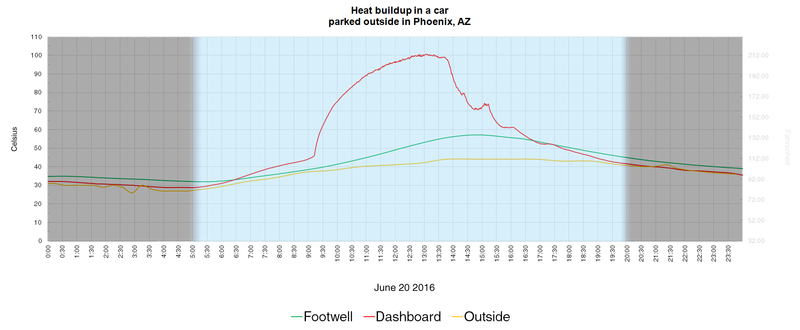
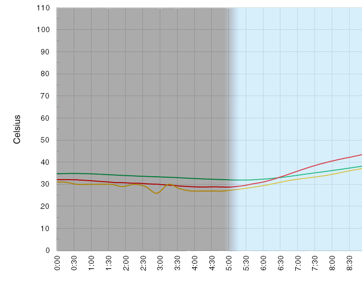

+++
linkTitle = "Car Temperatures in Phoenix"
title = "Car Temperatures in Phoenix"
draft = false
date = 2017-03-01
+++

Using a wireless microcontroller, I monitored the temperature on my car's dashboard and in the passenger footwell for a whole day during a particular hot spell in June in Phoenix. Even though I'm a Phoenix native, I was surprised by just how hot the inside of my car gets. The hardware components used were:

- [Particle Photon](https://docs.particle.io/photon/)
- 2 [Amphenol MA100BF103A](https://www.digikey.com/en/products/detail/amphenol-advanced-sensors/MA100BF103A/272974) NTC thermistors
- 3 C batteries (the heat really saps the batteries)

The programs I used for recording and processing data were:

- Particle command line interface
- MATLAB
- Excel



The sun rose at 5:18AM, when the outside temperature was 80.6F.



My car was parked in full shade of the neighbor's house to the east until 9:14AM. At that time, the dashboard temperature rapidly spikes, climbing at a rate of about 1F per minute. At 12:47PM, the dashboard reaches its peak of 212F - the boiling point of water! Meanwhile, the ambient (footwell) temperature is a tolerable 126.1F, and the outside temperature is 107.6F [joke about dry heat].


Around 1:45PM, the car moves into some tree shade, and the dashboard quickly cools off again. Meanwhile, the ambient temperature in the car continues to climb, peaking at 2:43PM at 134.8F. The outside temperature is 111.2F. From here, temperatures cool somewhat for the rest of the day.


The C++ code used to control the Particle Photon is as follows:

```C++
#include <math.h>
#include <Particle.h>

double thermistor1Analog; // contains raw analog data from thermistor 1 circuit VOut
double thermistor2Analog;
double thermistor1Resistance; // converts analog reading to resistance
double thermistor2Resistance;
double temperature1; // converts thermistor resistance to temperature, according to Amphenol datasheet
double temperature2;
String temperatures = ""; // store temperatures in a buffer, send the whole thing once buffer fills to conserve power
Timer tempTimer(60000, checkTemp); // Checks temperature once every minute

void setup()
{
    tempTimer.start(); // starts the timer
}

void loop()
{

}


void checkTemp()
{
    thermistor1Analog = analogRead(A5); // short thermistor
    thermistor2Analog = analogRead(A4); // long thermistor

    // convert resistance to ohms using voltage divider equation, where R1 = 10k ohms
    // shielded equation from dividing by zero by putting it in an if statement
    if (thermistor1Analog < 4095)
    {
        thermistor1Resistance = (9820*thermistor1Analog/4095)/(1-thermistor1Analog/4095); // 9820 is multimeter measurement of resistor
    }

    else if (thermistor1Analog >= 4095) // if the analog reads 4095, then there is a short or the thermistor has failed.
    {
        thermistor1Resistance = 0;
    }

    if (thermistor2Analog < 4095)
    {
        thermistor2Resistance = (9910*thermistor2Analog/4095)/(1-thermistor2Analog/4095); // 9910 is multimeter measurement of resistor
    }

    else if (thermistor2Analog >= 4095) // if the analog reads 4095, then there is a short or the thermistor has failed.
    {
        thermistor2Resistance = 0;
    }

    // calculated temperature by plotting a line of best fit using linear algebra and MATLAB. Error was found to be 3.7998*10^-4 Kelvins using Igor Pro. Compressed some of the math operations to reduce floating point error.
    temperature1 = pow((.0011106 + 0.00023724*log(thermistor1Resistance) + 0.000000074738*pow(log(thermistor1Resistance), 3)), -1) - 273.15;
    temperature2 = pow((.0011106 + 0.00023724*log(thermistor2Resistance) + 0.000000074738*pow(log(thermistor2Resistance), 3)), -1) - 273.15;
    // rounds the temperature to 2 decimals, truncates last 6 elements (trailing zeroes))
    // Particle.publish only accepts chars or strings
    temperatures += "s, ";
    temperatures += String(temperature1);
    temperatures += ", l, ";
    temperatures += String(temperature2);
    temperatures += ", ";
}

```
