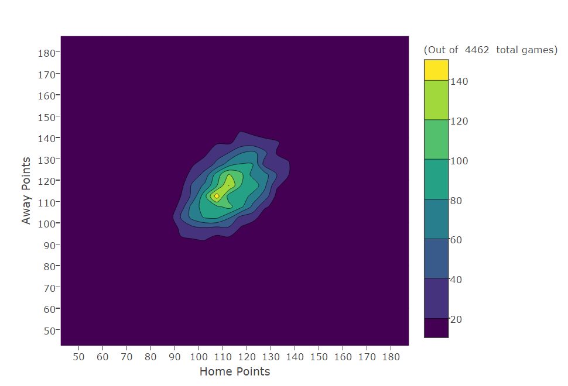
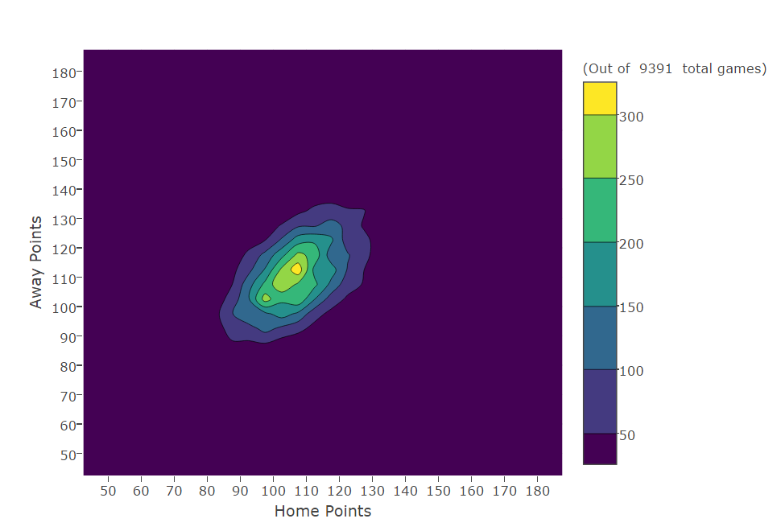
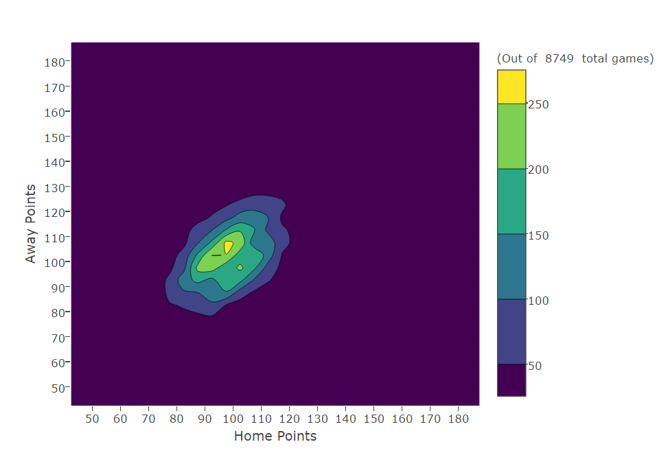
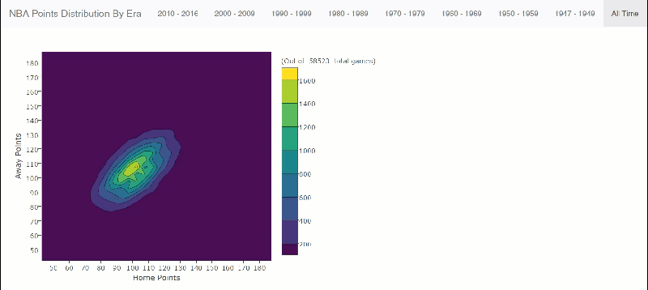

+++
linkTitle = "Visualizing NBA Pace"
title = "Visualizing NBA Pace"
draft = false
date = 2017-04-09
genres = ["technical"]
+++

## Part 1: Inspiration

I saw [this post](https://www.reddit.com/r/dataisbeautiful/comments/61rl0r/the_resulting_scores_of_15741_american_football/) and knew immediately that I needed to do something similar for the NBA. However, I had a few things going against me. Unlike [Pro Football Reference](http://www.pro-football-reference.com/boxscores/game-scores.htm), [Basketball Reference](http://www.basketball-reference.com) doesn't have one single page containing every single game that's ever been played. Rather, it is split up into [season and months](http://www.basketball-reference.com/leagues/). And that's because over 58 **thousand** NBA/ABA/BAA games have been played since the inception of professional basketball in 1946. This presented a challenge - I needed to store the outcomes of every single professional basketball game that's ever been played in one location so that I could start analyzing data and finding trends. And that's exactly what I did - I wrote an R script (getNBAgames.R) that builds a key-value pair of season:months, builds the URL where the games for that month are located, and then goes to that URL, gets the HTML table, converts it to a dataframe, and saves it as an R object. Then, I load the R objects into my Shiny app and feed the data into Plotly to generate heatmaps of the data.

The result is that I can visualize the pace of the game in a way that has never been done before - by era. I always hear talks of how the 60s had an unusually fast pace (based on raw numbers), but now I can actually <b>see</b> how much faster the game was back then! Likewise, you can see how lopsided matches are based on era - an oval distribution about the diagonal indicates relatively close matches, while a more circular shape indicates more lopsided victories.

This project took me much longer than I expected, but I am very pleased with the final results. The key for me was switching from ggplot2 to [plotly](https://plot.ly/) - I was able to render much nicer looking graphs with a lot less effort. I also learned how to finally make sweet loading bars! Future work includes parallelizing the for loop in the "All time" tab, but to be honest loading 50k+ data points in about 15 seconds is pretty decent, so I'm not too compelled to make this improvement. Another thing I want to add is an [adjustable time-series slider](http://www.htmlwidgets.org/showcase_dygraphs.html) so I can pick whatever date range I want and see what the pace of the game was for that custom era. Code for this project is open-source and available at https://github.com/AshwinSundar/Visualizing-NBA-Pace.

**Tools Used:**

[RStudio](https://www.rstudio.com/)  
[Shiny](https://www.rstudio.com/products/shiny/)  
[Plotly](https://plot.ly/)  
[XML](https://cran.r-project.org/web/packages/XML/index.html)  
[basketball-reference.com](http://www.basketball-reference.com/)

## Part 2: Visualizing NBA Pace by Era

### 1947 - 1949: The BAA

At its inception, professional basketball in the United States was united under the banner of the Basketball Association of America (BAA). It only existed for two season (46/47 and 47/48) before merging with the National Basketball League to form the NBA as we know it today. I couldn't find NBL data, so this data only includes 310 games from the BAA and NBA.

### 1950 - 1959: The shot clock-less NBA

The 50s saw the beginnings of the NBA, and the first dynasty that would be formed by George Mikan and the Minneapolis Lakers, who won 5 championships during this era. The slow pace during this time is largely due to the lack of a shot clock - the league introduced the 24-second shot clock in 1954 to discourage stalling and make the game more interesting for fans. The oval distribution of the plot along the diagonal axis indicates that games were relatively close during this time period - not too many lopsided victories.

### 1960 - 1969: The roaring 60s, Wilt Chamberlain, and Bill Russell

The 60s saw the first surge of all-stars that everyone has heard of - Wilt Chamberlain, Bill Russell, and Jerry West, just to name a few. Wilt famously scored 100 points in a game in this decade, and averaged 24 rebounds a game <b>for the entire decade</b>. Despite this, Bill Russell and the Celtics walked away with 9 out of the 10 championships in this era, with Bill putting up equally impressive numbers. The plot more closely resembles a circle now, and the distribution has trended upwards - indicating that the shot-clock and rise of the first superstars is increasing the number of lopsided victories and pushing the game to new heights.

### 1970 - 1979: Increasing parity

Unlike the previous decade, which saw only two champions, the 70s saw 8 different teams (Knicks, Bucks, Lakers, Celtics, Warriors, Trail Blazers, Bullets, SuperSonics) win a championship, with 4 of the 8 being first-time champions (Knicks, Trail Blazers, Bullets, SuperSonics). The NBA is growing in popularity, with star players like Kareem Abdul-Jabbar, Rick Barry, Julius Erving, Walt Frazier, Moses Malone, George Gervin, and Pete Maravich coming into their primes. The pace of the NBA is trending downwards, likely because of the increase in competition and the retirements of Bill Russell in 1969 and Wilt Chamberlain in 1973.

### 1980 - 1989: Magic Johnson's Showtime Lakers, Larry Bird's Celtics, and the rise of Michael Jordan

The NBA is now exploding in popularity - the merger of the ABA with the NBA in 1976 means that everyone is literally on the same playing field now. The decade starts out with an astounding championship led by rookie Magic Johnson's Lakers - the start of the Showtime Lakers dynasty that would pick up half of the championships for this decade. Larry Bird's Celtics pick up 3 championships, while the 76ers win the 1983 championship and the Bad Boy Pistons close out the decade with the first of their back-to-back championships. And of course, the rising star of the decade is Michael Jordan, who famously averages 37.1 points per game as a 24 year-old in just his 3rd season. The distribution of pace has tightened a bit, with more games ending around the 110-point marker than the previous decade. Overall though, the pace has not changed much since the last decade. This will change soon.

### 1990 - 1999: The Jordan-Pippen-Rodman Bulls dynasty, and the rise of the Shaq, Kobe, Duncan, and others

Finally, the decade I was born in and the decade I started watching basketball! I have very fond memories of watching Jordan absolutely destroying everything he touched, including the Mon-Stars. The Shot, the 3-peat, the second 3-peat - this decade was all Chicago Bulls. They arguably could have won 8 in a row, but the murder of Jordan's father in 1994 resulted in Jordan's first retirement from basketball, which opened the door for Hakeem's Houston Rockets to pick up their back-to-back championships. The pace is definitely trending downwards, probably because of an increasing focus on defense and the rise of dominant bigs, including Shaquille O'Neal, Tim Duncan, Hakeem Olajuwon, and Kevin Garnett. Several future all-stars will be drafted from the extraordinarily deep 1996 NBA draft including Allen Iverson, Stephon Marbury, Ray Allen, Kobe Bryant, Peja Stojakovic, Steve Nash, Jermaine O'Neal, and Ben Wallace (who was actually undrafted!).

### 2000-2009: Changing game dynamics, and the rise of the current generation

This decade is marked by a new Lakers dynasty, and the often-underrated Spurs dynasty that picked up 3 championships (4 if you include the championship at the end of the previous decade). The current standard-bearers in LeBron James, Dwyane Wade, Carmelo Anthony, and others found their beginnings in this decade. Shaq and Kobe's Lakers ultimately dominated this decade, bringing home the first 3 championships, and dropping a fourth to the vastly underrated 2004 Pistons, led by Chauncey Billups and Ben Wallace. Tim Duncan, Tony Parker, and Manu Ginobili exemplify consistency in this decade, and behind Greg Popovitch's leadership they secure 3 championships in alternating years (not including the fourth that they won at the end of the previous decade). Pace continues to trend downward, albeit at a slower rate. This could be because big men are coming back into vogue, making it more difficult to secure easy points at the basket. Teams begin exploring options at the 3-point line, and guards become a highly-prized commodity in this decade. Teams that can pass well enjoy a great deal of success, including the Spurs and my home team Phoenix Suns led by Steve Nash and Mike D'Antoni (Go Suns!). In fact, the Suns set a new standard and set some of the highest offensive ratings of all time, arguably paving the way for modern-day offenses like the Golden State Warriors and Houston Rockets.

### 2010-2016: The modern era

Our current era began with the second of Kobe's Lakers' back-to-back championships, the infamous Decision, and the subsequent domination of Lebron James (after a false start). With regards to game pace, it appears as though it is trending upwards again - more games are ending at around 100 points, as compared to the previous decade. We still have a few more years left in the decade, but if the current trends continue (domination of high-scoring teams, the rise of unbelieavably talented guards, multi-dimensional bigs), then we can expect this decade to be one of the highest-scoring in some time.

(Side note: I did not collect 2016-2017 data yet, since the season hasn't ended and
basketball-reference.com is still updating)

**And finally, here's an animation so you can see all this data at once.**

## Conclusion

The pace of the NBA has fluctuated over time. People like to partition the NBA into modern-era and pre-modern era, since the pace was so different in the 60s. And this is definitely true. However, it's important to note that just because the pace was faster, doesn't mean the records set and feats achieved back then aren't as impressive. The players still had to play at that increased pace, making basketball more of an endurance sport than it is today. Scoring 50 points a game or averaging 25+ boards is still an impressive feat regardless.

It has been a lot of fun putting this together! I love NBA statistics (if that wasn't clear already), and I've always felt like there is a better way to understand pace. I think these visualizations make it a lot more obvious how pace trends over time, and it jives with the rest of the conclusions we hear about constantly - that pace was a lot higher in the past, and is starting to trend upwards again. Hope you enjoyed this! Please feel free to email me at ashiundar@gmail.com if you've got code questions. Lastly, I want to thank <a href = 'https://github.com/zonination'>Zoni Nation</a> for inspiring me with <a href = 'https://www.reddit.com/r/dataisbeautiful/comments/61rl0r/the_resulting_scores_of_15741_american_football/'>his post</a> about how he analyzed NFL games on <a href = ' https://www.reddit.com/r/dataisbeautiful/ '>/r/dataisbeautiful</a>, which is a fantastic subreddit that you all should subscribe to!
